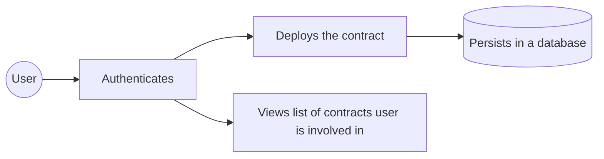

# Ethereum Escrow dApp
This is a Escrow dApp developed for ethereum blockchain.

## User flow


## Getting Started

First, run the development server:

```bash
npm run dev
# or
yarn dev
# or
pnpm dev
# or
bun dev
```
